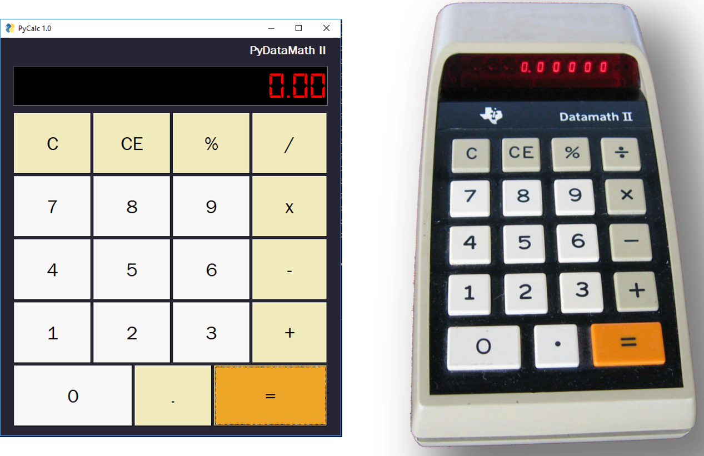

# PyDataMath-II
A simple Python calculator gui application based loosely on the [Texas Instruments DataMath II](https://americanhistory.si.edu/collections/search/object/nmah_1364035) produced circa 1975.

The code includes 4 progressive steps used to build the application as part of a [YouTube]() tutorial. Step 4 is the finished product.

Requirements: PySimpleGUI `pip install pysimplegui` or `conda install pysimplegui`

I'm using a [Digital-7 font](https://www.1001fonts.com/digital+clock-fonts.html) on the display. Download and install if you want to use it, but it's optional. You can use another font if you choose, such as "OCR A Extended" which comes packaged with Windows. But, I think the Digital-7 font looks nice. Please keep in mind that the button and text field sizing is based on the selected font, so if you use another font-type, you may need to tweek the button sizes.

